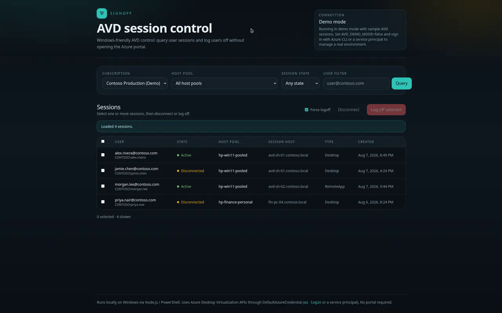
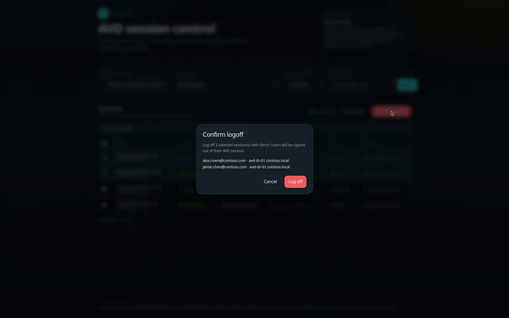

# SignOff — AVD Session Manager (Windows)

Query **Azure Virtual Desktop (AVD)** user sessions on a **Windows** workstation and log users off (or disconnect them) **without opening the Azure portal**.

Built for Windows admins using PowerShell, Node.js, and Azure CLI / service principal auth.

## App preview

### Session dashboard



### Logoff confirmation



## What it does

- Lists Azure subscriptions available to your Windows credentials
- Lists AVD host pools in a subscription
- Queries user sessions (filter by host pool, session state, or UPN)
- Selects one or more sessions and **logs them off** (force optional) or **disconnects** them

All actions call the Azure Desktop Virtualization management APIs (`Microsoft.DesktopVirtualization`) from this local app.

## Windows prerequisites

1. **Windows 10/11** (or Windows Server with desktop experience)
2. **Node.js 20+ LTS** — [nodejs.org](https://nodejs.org) or:
   ```powershell
   winget install -e --id OpenJS.NodeJS.LTS
   ```
3. For live AVD (not demo mode): **Azure CLI**
   ```powershell
   winget install -e --id Microsoft.AzureCLI
   ```

## Quick start (Windows PowerShell)

From the repo folder:

```powershell
# One-time / every start — installs deps if needed, creates .env.local, launches app
.\scripts\Start-SignOff.ps1
```

Or double-click `Start-SignOff.cmd`.

Then open [http://localhost:3000](http://localhost:3000).

### Demo mode (no Azure account)

Demo mode is on by default so you can explore the UI immediately:

```powershell
.\scripts\Start-SignOff.ps1 -Demo
```

`.env.local` contains:

```env
AVD_DEMO_MODE=true
```

### Real Azure environment on Windows

1. Sign in with Azure CLI (browser login on Windows — still no portal needed for session ops):

   ```powershell
   .\scripts\Connect-AzureForSignOff.ps1
   # optional:
   .\scripts\Connect-AzureForSignOff.ps1 -SubscriptionId "<your-subscription-guid>"
   ```

2. Edit `.env.local`:

   ```env
   AVD_DEMO_MODE=false
   ```

3. Start the app:

   ```powershell
   .\scripts\Start-SignOff.ps1
   ```

4. In the UI: pick subscription → host pool → **Query** → select sessions → **Log off selected**.

#### Service principal (optional, headless)

Set these in `.env.local` or your Windows user environment:

```env
AVD_DEMO_MODE=false
AZURE_TENANT_ID=...
AZURE_CLIENT_ID=...
AZURE_CLIENT_SECRET=...
```

PowerShell session example:

```powershell
$env:AVD_DEMO_MODE = "false"
$env:AZURE_TENANT_ID = "<tenant>"
$env:AZURE_CLIENT_ID = "<app-id>"
$env:AZURE_CLIENT_SECRET = "<secret>"
.\scripts\Start-SignOff.ps1
```

#### Required Azure permissions

Assign the identity a role that can manage AVD sessions, for example:

- **Desktop Virtualization Contributor**, or a custom role with:
  - `Microsoft.DesktopVirtualization/hostpools/*/read`
  - `Microsoft.DesktopVirtualization/hostpools/sessionhosts/userSessions/read`
  - `Microsoft.DesktopVirtualization/hostpools/sessionhosts/userSessions/delete`
  - `Microsoft.DesktopVirtualization/hostpools/sessionhosts/userSessions/disconnect/action`
- Scope: subscription or the resource group that contains your host pools

## Scripts

| Command | Description |
| --- | --- |
| `.\scripts\Start-SignOff.ps1` | Windows launcher (dev server) |
| `.\scripts\Start-SignOff.ps1 -Demo` | Force demo mode |
| `.\scripts\Start-SignOff.ps1 -Production` | `npm run build` then `npm start` |
| `.\scripts\Connect-AzureForSignOff.ps1` | `az login` helper for Windows |
| `npm run dev` | Start Next.js directly |
| `npm run build` / `npm start` | Production build & run |
| `npm test` | ARM id parsing smoke test |

If PowerShell blocks scripts:

```powershell
Set-ExecutionPolicy -Scope CurrentUser RemoteSigned
```

## API surface

| Method | Path | Purpose |
| --- | --- | --- |
| `GET` | `/api/status` | Auth / demo mode status |
| `GET` | `/api/subscriptions` | List subscriptions |
| `GET` | `/api/hostpools?subscriptionId=` | List host pools |
| `GET` | `/api/sessions?...` | List user sessions |
| `POST` | `/api/sessions/logoff` | Log off selected sessions |
| `POST` | `/api/sessions/disconnect` | Disconnect selected sessions |

### Logoff body

```json
{
  "force": true,
  "sessions": [
    {
      "subscriptionId": "...",
      "resourceGroup": "rg-avd-prod",
      "hostPoolName": "hp-win11-pooled",
      "sessionHostName": "avd-sh-01.contoso.local",
      "userSessionId": "1"
    }
  ]
}
```

## Notes

- Targets **Windows** operators; Node.js + PowerShell are the supported local runtime.
- Logoff uses the AVD `UserSessions - Delete` operation (`force` logs the user off even when required).
- Disconnect uses `UserSessions - Disconnect` (session remains, connection drops).
- You do **not** need the Azure portal to query or log off sessions — only ARM API access via CLI or a service principal.
